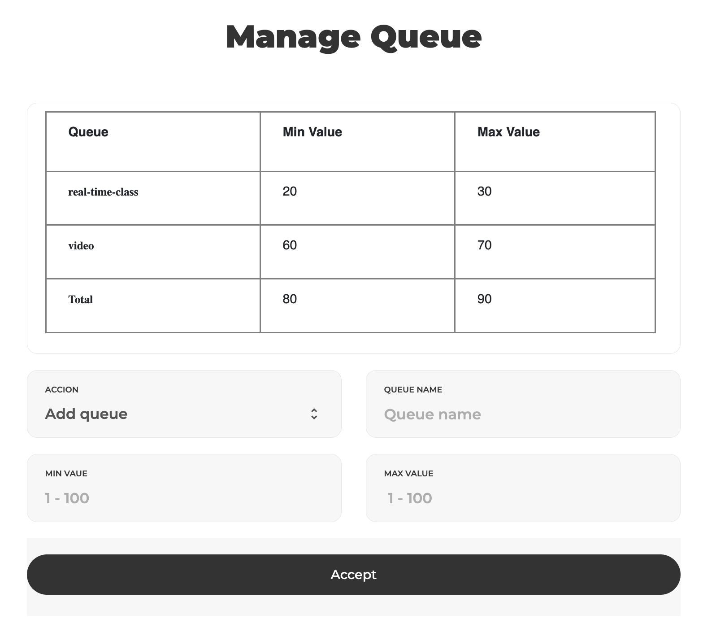

# FailOver and QoS Automation

A collection of Python Code Samples to automate the QoS queue adjustment in Cisco routers running IOS XR. This development includes the use of CISCO EPN-M's APIs to detect drops in the configured priority queues of the routers and CISCO NSO's APIs to send and validate the changes to the network, depending on the thresholds configured by the customer.



## Installation (required)

**Steps:**

The first step is clone the repository
```bash
git clone git@github.com:SDNETMEX/FailOverQoSDevNet.git
```

Go to the project folder
```bash
cd  FailOverQoSDevNet
```

The project consists of two parts, the first one is a websocket that connects to EPN Manager, and receives every alert that this tool generates. To make it run, set up a python2 virtual environment

First you need to have identified the path to the version of python2 installed, example:

```bash
/home/username/opt/python-2.7.15/bin/python
```

Install virtualenv via pip
```bash
pip install virtualenv
```

Navigate to the path where the virtual environment will be created

```bash
cd /path
```

Create the virtual environment
```bash
virtualenv -p /home/username/opt/python-2.7.15/bin/python venv
```

Make sure that the next dependencies are installed using pip
```bash
pip install ws4py requests
```

Now there is all set to execute the websocket that will make the connection to EPN Manager

The second part of the development is a web portal which works as a management tool to control the upper and lower limits of the QoS queues, as well as the rest of the intelligence which is also written in python 3. This app uses flask, between other dependencies, which can be installed using another virtual environment, but this time, using python3, executing the following commands:

First you need to have identified the path to the version of python3 installed, example:

```bash
/home/username/opt/python-3.10/bin/python
```

Install virtualenv via pip
```bash
pip3 install virtualenv
```

Navigate to the path where the virtual environment will be created

```bash
cd /path
```

Create the virtual environment
```bash
virtualenv -p /home/username/opt/python-3.10/bin/python venv
```

Make sure that the next dependencies are installed using pip
```bash
pip3 install -r requirements.txt
```

## Configuration (optional)

The code uses some variables such as IP's for both NSO and EPN manager, as well as the authorization keys to use the REST API's of these tools. You can edit the code to place those variables, but it is recommended to set environment variables, which is the way that the code is designed natively.
Such variables as well as the command to set them, are the following:

This variable is the IP of your EPN Manager
export IP_EPN=x.x.x.x

The authorization key for the use of the EPN Manager API's
export AUTH_EPN=x.x.x.x

The cookie needed for EPN Manager
export COOKIE=x.x.x.x

The username for EPN Manager
export username=x.x.x.x

The password for EPN Manager
export password=x.x.x.x

This variable is the IP of your NSO
export IP_NSO=x.x.x.x

The authorization key for the use of the NSO API's
export AUTH_NSO=x.x.x.x

There is also a script that connects to a device using ssh, which needs the following variables

The username for SSH
export username_ssh=x.x.x.x

The password for SSH
export password_ssh=x.x.x.x

## Usage (required)

Once the python2 virtual environment is all set, it can be executed with the following command

```bash
nohup python rest_alarms.py
```

This will be enough to get most of the development running, because it will detect certain kind of alarms and act accordingly, but there is also the management portal which needs the next dependencies, that are also necessary to run some of the python3 code of the application. To do so, run the next command.

```bash
pip install requirements.txt
```

Then, to make the flask app run, execute the following command

```bash
python3 mainfoqos.py
```

Finally, you can access web development as follows:

```bash
x.x.x.x:80
```
----